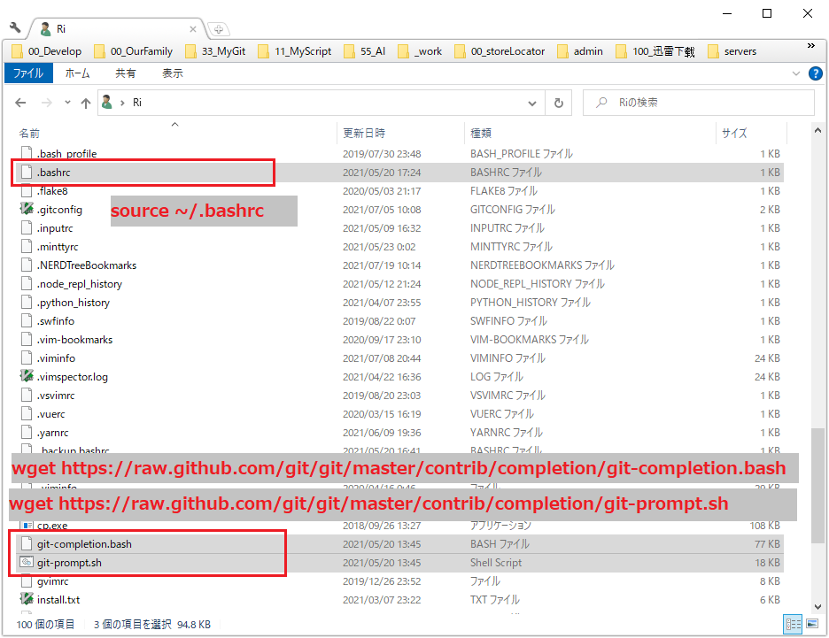

# Git Memo
## Git Add
#### Gitで変更があったファイルのみAddしたい

    git add -u

## Git Log
#### Gitで一定期間中、コミット毎変更されたファイル一覧を見る(ソース修正量含む)

    git logg --stat HEAD~1..HEAD

    * 9a5cc076 [2021/04/09 15:19:53]  (HEAD -> feature_Sprint37_新商品対応Spectrum30p) Sprint37_新商品対応：Spectrum30p_detail-print対応済 | 
    |  PC/AcuvuePC/detail-print.aspx             | 8 ++++++++
    |  PC/AcuvuePC/detail-print.aspx.designer.vb | 9 +++++++++
    |  PC/AcuvuePC/detail-print.aspx.vb          | 8 ++++++++
    |  3 files changed, 25 insertions(+)

    * a5986d37 [2021/04/09 13:47:54]  Sprint37_新商品対応：Spectrum30p_detail対応済 | 
    |  PC/AcuvuePC/detail.aspx             | 13 +++++++++++++
    |  PC/AcuvuePC/detail.aspx.designer.vb |  9 +++++++++
    |  PC/AcuvuePC/detail.aspx.vb          |  8 ++++++++
    |  3 files changed, 30 insertions(+)

#### Gitで一定期間中、コミット毎変更されたファイル一覧を見る

    git logg --name-only HEAD~1..HEAD

    (例) 以下のコミットがある場合：
    *   558e2691 [2021/02/25 09:25:15]  (HEAD -> master, origin/master, origin/HEAD) Sprint33_新商品対応 
    |\  
    | * 74e18b11 [2021/02/18 14:18:59]  Sprint33_新商品登録:BugFix_index画面でBrandIDを指定すると新商品にチェックがついてない不具合を修正 
    | * 00995610 [2021/02/18 13:53:27]  Sprint33_新商品対応:BugFix_detailとdetail-printのデザインがTempleHtmlと一致しない部分を修正 
    | * 9fe17dcd [2021/02/18 10:35:10]  Sprint33_新商品対応:Spectrum10p_detail-print対応済 
    | * d221c0cf [2021/02/17 20:37:35]  Sprint33_新商品対応:Spectrum10p_detail対応済 
    | * d238782c [2021/02/17 17:28:41]  Sprint33_新商品対応:Spectrum10p_result追加対応_DB取得処理と関連javascriptを含む 
    | * 65d57a0f [2021/02/16 14:11:53]  Sprint33_新商品対応:Spectrum10p_result対応済 
    | * 8b9cfd0f [2021/02/16 11:53:04]  Sprint33_新商品対応:Spectrum10p_index対応済 
    |/  
    *   2cd68e8b [2021/01/26 09:45:33]  Sprint30_XSS脆弱性対応_Flagshopバナー削除_PartnerShop文言変更 
    |\  

    出力結果は以下の通り

    * 558e2691 [2021/02/25 09:25:15]  (HEAD -> master, origin/master, origin/HEAD) Sprint33_新商品対応 
    * 74e18b11 [2021/02/18 14:18:59]  Sprint33_新商品登録:BugFix_index画面でBrandIDを指定すると新商品にチェックがついてない不具合を修正 | 
    | PC/AcuvuePC/index.aspx.vb

    * 00995610 [2021/02/18 13:53:27]  Sprint33_新商品対応:BugFix_detailとdetail-printのデザインがTempleHtmlと一致しない部分を修正 | 
    | PC/AcuvuePC/detail-print.aspx
    | PC/AcuvuePC/detail.aspx

#### 差分を見るいつくかの方法

1. commit前の場合<br>
    diffで見る

1. commit後の場合
    1. git logで回数もしくはブランチ間の変更を見る方法<br>
    ```コマンド
    git logg -p -n 2 DirectoryA/FileName1
    git logg -p Branch_from..Branch_to(←省略可能)  DirectoryA/FileName1
    ```

    1. git showで任意の過去時点での変更を見る方法<br>
    ```コマンド
    git show SHA-number DirectoryA/FileName1
    ```

#### 一つのコミットの変更状況を調べる

    git show 00995610 PC/AcuvuePC/detail-print.aspx
    更に詳しく見るためには
    git log -S 'changed_content' --patch test.vb

#### 特定ファイルの過去3回分のログを見たい(n:回数 p:差分形式)

    git logg -n 3 -p AA/BB.txt

#### Gitで特定ファイルのある時点から現在までの変更履歴を見る(ファイルパス曖昧指定)

    e.g. パス名は不明であるが、ファイル名だけ分かる場合、
    masterブランチのコミット時点から、最新のコミット時点までの変更履歴を見たい

    git logg -p master.. */icon.js 

    (結果)

    * 7db4ead0 [2021/04/26 11:54:49]  Sprint38:パートナーショップ廃止_result_地図及び店舗リストのパートナーショップ表示廃止   
      diff --git a/PC/AcuvuePC/shared/js/icon.js b/PC/AcuvuePC/shared/js/icon.js
      index 0e3bc115..3ded79f7 100644
      --- a/PC/AcuvuePC/shared/js/icon.js
      +++ b/PC/AcuvuePC/shared/js/icon.js
      @@ -6,7 +6,10 @@
           // JSONで来る場合と配列で来る場合があるので最初のプロパティの有無で判定する。
           var isArray = (typeof marker.RunsAnyFreeTrial === "undefined")
           var FS = (marker.RunsFlagShip || isArray && marker[FLAGSHIP] === TRUE)          ? "FS_" : "";
      -    var P = (marker.RunsPartnerShop || isArray && marker[PARTNERSHOP] === TRUE)     ? "P" : NA;
      +    // '2021/04/20 パートナーショップ廃止対応 --START--
      +    // var P = (marker.RunsPartnerShop || isArray && marker[PARTNERSHOP] === TRUE)     ? "P" : NA;
      +    var P = NA;
      +    // '2021/04/20 パートナーショップ廃止対応 --END--
           var E = (marker.RunsAOS || isArray && marker[AOS] === TRUE) ? "E" : NA;
       
           //var M = (marker.RunsOmisedePoint || isArray && marker[MYACUVUE] === TRUE)       ? "M" : NA;
      @@ -61,4 +64,4 @@
           return new MarkerImage(getIconsByMarker(marker) + "-focus" + EXTENTION, new ZDC.WH(68, 68), new ZDC.Pixel(-34, -65));
         };
       
      -})();
      \ No newline at end of file
      +})();


#### Gitで特定ファイルが含まれているコミットを確認したい

    正規表現を使うが、\dなどは使えない（POSIX正規表現形式）
    (e.g) masterブランチの最新コミットから現ブランチのHEADまで
          store.css?20210401の文字列が入ったコミット一覧を見たい場合

    git logg -p -S "store.css\?2021[0-9]{4}" --pickaxe-regex  master..

    (結果)
    * 9bd8343b [2021/05/26 14:01:00]  Sprint38:パートナーショップ廃止_store_list対応済（地図表示はCSS変更が必要） | 
    | diff --git a/batch/BCTK005/CreateRunningStoreList/TemplateHtml/templateStoreHTML.htm b/batch/BCTK005/CreateRunningStoreList/TemplateHtml/templateStoreHTML.htm
    | index 880a34da..4dbbd3fa 100644
    | --- a/batch/BCTK005/CreateRunningStoreList/TemplateHtml/templateStoreHTML.htm
    | +++ b/batch/BCTK005/CreateRunningStoreList/TemplateHtml/templateStoreHTML.htm
    | @@ -9,7 +9,7 @@
    |      <meta name="date" content="2014-10-28" scheme="YYYY-MM-DD">
    |      <link rel="stylesheet" href="/shared/css/base.css">
    |      <link rel="stylesheet" href="/shared/css/parts.css">
    | -    <link rel="stylesheet" href="/store/shared/css/store.css">
    | +    <link rel="stylesheet" href="/store/shared/css/store.css?20210420">
    |  
    |      <!-- _____________________________ 2018.07.02 今回追加 _____________________________ -->
    |      <link rel="stylesheet" href="/store/shared/css/store_header_footer.css?20200121">
    | @@ -40,8 +40,8 @@
    |      <script src="../../store/shared/js/isPC.js"></script>
    |      <script src="../../store/shared/js/map.js"></script>
    |      <script src="../../store/shared/js/store.js"></script>
    | -    <script src="../../store/shared/js/icon.js"></script>
    | -    <script src="../js/store_list_htm.js"></script>
    | +    <script src="../../store/shared/js/icon.js?20210420"></script>
    | +    <script src="../js/store_list_htm.js?20210420"></script>
    |      <script src="../js/jquery.blockUI.js"></script> 
    |      <!-- <<<<<<<<<< 2017/03/13 4.18.0 ADD #ENH-0041 -->
    |      <script>
    | @@ -128,11 +128,16 @@
    |                  <div class="icnBoxPopupArw"></div>
    |                  <div class="icnBoxPopupInr">
    |                    <h3><a href="javascript:;" class="js-iconlegendclose"></a><span>アイコン凡例</span></h3>
    | -                  <dl class="icnBoxItemAP">
    | -                    <dt>アキュビュー<sup>&reg;</sup> パートナーショップ</dt>
    | -                    <dd>アキュビュー<sup>&reg;</sup> 新製品の先行発売など、ショップ限定のサービスメニューをご用意しています。<br>
    | -                      <span style="font-size:90%;">※新製品の取扱いは、パートナーショップにより異なります。</span></dd>
    | -                  </dl>
    | +
    | +
    | +                  <!--  2021/04/20 パートナーショップ廃止対応 START ADD -->
    | +                  <!-- <dl class="icnBoxItemAP"> --!>
    | +                  <!--   <dt>アキュビュー<sup>&reg;</sup> パートナーショップ</dt> --!>
    | +                  <!--   <dd>アキュビュー<sup>&reg;</sup> 新製品の先行発売など、ショップ限定のサービスメニューをご用意しています。<br> --!>
    | +                  <!--     <span style="font-size:90%;">※新製品の取扱いは、パートナーショップにより異なります。</span></dd> --!>
    | +                  <!-- </dl> --!>
    | +                  <!-- 2021/04/20 パートナーショップ廃止対応 END ADD -->
    | +
    |                    <!--20190401 リリース 定期便-->
    |                    <dl class="icnBoxItemAT">
    |                      <dt>アキュビュー<sup>&reg;</sup> 定期便サービス加盟店</dt>
    | @@ -162,9 +167,14 @@
    |              </div>
    |              <!--partnershop info-->
    |              <div class="partnerShopArea noSP">
    | -              <h2><span></span>アキュビュー<sup>&reg;</sup> パートナーショップ</h2>
    | -              <p>アキュビュー<sup>&reg;</sup> 新製品の先行発売など、ショップ限定のサービスメニューをご用意しています。<br><span style="font-size:90%;">※新製品の取扱いは、パートナーショップにより異なります。</span></p>
    | +
    | +            <!--  2021/04/20 パートナーショップ廃止対応 START ADD -->
    | +              <!-- <h2><span></span>アキュビュー<sup>&reg;</sup> パートナーショップ</h2> --!>
    | +              <!-- <p>アキュビュー<sup>&reg;</sup> 新製品の先行発売など、ショップ限定のサービスメニューをご用意しています。<br><span style="font-size:90%;">※新製品の取扱いは、パートナーショップにより異なります。</span></p> --!>
    | +            <!--  2021/04/20 パートナーショップ廃止対応 END ADD -->
    | +
    |                <!--/partnershop info-->
    | +
    |              </div>
    |            <!--/iconGlobalArea-->
    |            </div>


#### Gitで特定ファイルの変更履歴を見る

    git log -p Directory1/FileName1

#### 現在のコミットから過去2回分の特定ファイル(フォルダ)の変更文字単位を見る
    e.g. 表示の仕方は 1:HEAD..HEAD~1 2:HEAD~1..HEAD~2
    git log --word-diff HEAD -n 2 -p batch/BCTK005/template_html/

#### 昨日からの変更したログ一覧を見たい

    git logg --since='yesterday'

#### 日付を指定

    git logg --since='7 days'

#### 月を指定

    git logg --since='1 month'
    git logg --since=1.months
    git log --after '2018-05-27 00:15:00'

#### 相対的な日時での指定

    git log --after 'yesterday'
    git log --after 'last Monday' ←先週の月曜日

    月曜日:Monday 火曜日:Tuesday 水曜日:Wednesday 木曜日:Thursday 金曜日:Friday 土曜日:Saturday 日曜日:Sunday
    git log --after '1 month 3 days ago'

#### 特定ブランチのログを見たい

    git logg develop

#### SVN関連のブランチを見たくない場合

    git logg --banches master develop

#### マージコミットの詳細を見たくない場合

    1.git logg --merges

#### 特定タグ以降のログを見たい

    git logg start_tagName..

#### 特定の文字列が含まれたコミットを見たい
    例：文字列"oasys_ast"が含まれるコミットを差分形式(patch)で
    タグ"sprint14_start"から"sprint14_end"間でみたい

    git log -S 'oasys_ast' --patch  sprint14_start..sprint14_end

## Git Diff
#### 前回のコミットから変更をファイル単位で見る

    git diff  --name-only HEAD~3..HEAD  （ファイル単位で出力）
    git diff  --stat HEAD~3..HEAD  （ファイル単位尚且修正行数が表示される）

#### 前回のコミットから変更を特定のファイルのみ確認する

    git diff  4a9f44e..c92939d BCTK001/HealthCheck/HealthCheck.vbproj

#### コミット間の変更を特定のフォルダだけ見る
    git diff  --name-only HEAD~3..HEAD  --relative=BCTK001

#### ブランチを比較

    git diff master..develop
    git diff --word-diff master..develop <Directory>/<FileName>

#### コミット履歴でどれくらいのファイルが変更したかを見たい
    git diff HEAD~3..HEAD --name-only

#### リモートレポジトリとローカルリポジトリの差分を確認する
    git diff HEAD..FETCH_HEAD

#### 取り込み先の差分をビジュアルモードにして、取り込み元の内容を取り込む
    :diffget

#### Visual-mode で範囲を選択した後に、その範囲を反対側のバッファへ適用する
    :diffput

#### diff modeの差分情報を最新にする

    :diffupdate

## Git Rebase&Reset
#### 過去のコミットの内容を修正する(注意：必ずGitbashから実行すること)
[参考URL:Gitマニュアル-歴史の書き換え](https://git-scm.com/book/ja/v2/Git-%E3%81%AE%E3%81%95%E3%81%BE%E3%81%96%E3%81%BE%E3%81%AA%E3%83%84%E3%83%BC%E3%83%AB-%E6%AD%B4%E5%8F%B2%E3%81%AE%E6%9B%B8%E3%81%8D%E6%8F%9B%E3%81%88)

    1. git rebase -i HEAD~2 　←　修正したいコミットまでのoffset + 1
    2. 別ウィンドウでGvimが開かれるが、その時コミットしたいSHAのpickをeditに変更
       して終了。
    3. gitBashターミナルに戻る。
    4. エディターもしくはIDEで追加対象であるfileAの変更を行う。
    5. git add fileA
    6. git commit --amend (この操作で修正対象のコミットにfileAを追加することになる) OR
       git commit --amend -m "新しいコメント入力"
       gitのコミット一覧ファイルがVim上に立ち上がるので、
       コメントメッセージなど適切に変更して、保存終了する。
    7. git rebase --continue でRebase作業を終了する。

    これで過去任意時点でのコミットの変更ができる。
    またgitのコミット一覧ファイルからコミット順番を変更することもできる。


    途中でやめたい場合は、git rebase --abort


#### rebase --rebase-merge で過去のマージブランチの中にあるコミットを修正する


    *   1b9cf2f4 [2021/05/25 14:18:08]  (HEAD -> develop_fix) Sprint39:都度便対応 
    |\  
    | * 9c8a98a2 [2021/05/25 14:18:04]  Sprint39:都度便対応_Bugfix_result画面コメント歴あり 
    | * 00e903cb [2021/05/25 14:18:03]  Sprint39:都度便対応_市区町村一覧画面対応済 
    | * eb989d8c [2021/05/25 14:18:02]  Sprint39:都度便対応_detail-print対応済 
    | * c5f4f303 [2021/05/25 14:18:00]  Sprint39:都度便対応_detail対応済 
    | * d259f914 [2021/05/25 14:17:59]  Sprint39:都度便対応_result対応済 
    | * 3f4271bf [2021/05/25 14:17:58]  Sprint39:都度便対応_index対応済 
    |/  
    *   ef38cfa8 [2021/05/25 14:17:58]  Sprint38_パートナーショップ廃止 
    |\  
    | * ab794883 [2021/05/25 14:17:57]  Sprint38:パートナーショップ廃止_v_conversion_account対応済 
    | * f09389ec [2021/05/25 14:17:57]  Changed_スクリプトファイルのencodeをsjisからutf8に変更 
    | * a15e5f62 [2021/05/25 14:17:57]  Deleted_不要なViewスクリプトを削除 
    | * 5a34f031 <-- 修正対象 [2021/05/25 14:17:31]  Sprint38:パートナーショップ廃止_store_list対応済 
    | * 792a2be1 [2021/04/26 14:07:06]  Sprint38:パートナーショップ廃止_detail-print対応済 
    | * 61e8305f [2021/04/26 14:06:39]  Sprint38:パートナーショップ廃止_detail対応済 
    | * 7db4ead0 [2021/04/26 11:54:49]  Sprint38:パートナーショップ廃止_result_地図及び店舗リストのパートナーショップ表示廃止 
    | * 19a0f428 [2021/04/26 11:54:15]  Sprint38:パートナーショップ廃止_result_画面からパートナーショップcheckbox及び文言削除 
    | * 3c796e1c [2021/04/26 11:53:04]  Sprint38:パートナーショップ廃止_result_内部処理無効化 
    | * fe77e7ad [2021/04/26 11:52:26]  Sprint38:パートナーショップ廃止_index対応済 
    |/  
    *   13eb7454 [2021/04/20 09:54:24]  Sprint37_新商品対応（pectrum30p） 
    |\  
    | * 9a5cc076 [2021/04/09 15:19:53]  Sprint37_新商品対応：Spectrum30p_detail-print対応済 
    | * a5986d37 [2021/04/09 13:47:54]  Sprint37_新商品対応：Spectrum30p_detail対応済 
    | * ce04935f [2021/04/08 17:31:32]  Sprint37_新商品対応：Spectrum30p_result追加対応_DB関連処理とjavascriptを含む 

    手順：
    git rebase --rebase-merge  -i HEAD~2
    (Vimエディタでcommit一覧が開かれるので、 修正対象のコミット5a34f031をeditに変更し、:wqする)
    出力例：

    label onto

    # Branch Sprint38-パートナーショップ廃止
    reset onto
    pick fe77e7ad Sprint38:パートナーショップ廃止_index対応済
    pick 3c796e1c Sprint38:パートナーショップ廃止_result_内部処理無効化
    pick 19a0f428 Sprint38:パートナーショップ廃止_result_画面からパートナーショップcheckbox及び文言削除
    pick 7db4ead0 Sprint38:パートナーショップ廃止_result_地図及び店舗リストのパートナーショップ表示廃止
    pick 61e8305f Sprint38:パートナーショップ廃止_detail対応済
    pick 792a2be1 Sprint38:パートナーショップ廃止_detail-print対応済
    pick 5a34f031 Sprint38:パートナーショップ廃止_store_list対応済（地図表示はCSS変更が必要）
    pick a15e5f62 Deleted_不要なViewスクリプトを削除
    pick f09389ec Changed_スクリプトファイルのencodeをsjisからutf8に変更
    pick ab794883 Sprint38:パートナーショップ廃止_v_conversion_account対応済
    label Sprint38-パートナーショップ廃止

    # Branch Sprint39-都度便対応
    reset onto
    merge -C ef38cfa8 Sprint38-パートナーショップ廃止 # Sprint38_パートナーショップ廃止
    label branch-point
    pick 3f4271bf Sprint39:都度便対応_index対応済
    pick d259f914 Sprint39:都度便対応_result対応済
    pick c5f4f303 Sprint39:都度便対応_detail対応済
    pick eb989d8c Sprint39:都度便対応_detail-print対応済
    pick 00e903cb Sprint39:都度便対応_市区町村一覧画面対応済
    pick 9c8a98a2 Sprint39:都度便対応_Bugfix_result画面コメント歴あり
    label Sprint39-都度便対応

    reset branch-point # Sprint38_パートナーショップ廃止
    merge -C 1b9cf2f4 Sprint39-都度便対応 # Sprint39:都度便対応

    # Rebase 13eb7454..1b9cf2f4 onto 13eb7454 (25 commands)

    以下のようにファイルを修正し、コミットする
    git add .
    git commit --amend
    git rebase --continue

    結果：
    マージポイントは維持したまま、コミットのみ変更される。


#### rebaseで枝分けを直す

masterからdevelopブランチを切った後に、masterから他のcommitがある際
masterブランとdevelopブランチが枝分かれした時点から変更された
すべてのcommitをdevelopに取り込む際にrebaseを使うべき
図で例を示します。 

現ブランチがtopicでmasterブランチGまで完成したソースの後に
topicブランチのA~Cまでの変更を適用したい

 ___git rebase  master___

    (Before)
              A---B---F---C topic
             /
        D---E---F---G master
    
    (After)
                      A'--B'--C' topic
                     /
        D---E---F---G master


    コンフリクトが発生した場合
    1. mergetoolでコンフリクト解決
    2. git add .
    3. git rebase --continue

#### rebaseでブランチに散らかして存在する特定のtopicのみのコミットだけ抽出する(直列化)

下記のようなマージしたブランチで**Topic A**だけの履歴を残したい

    (Before)
                                  (A_v11)
                  [A1]---[C1]-----[A2]    
                   /                  \
      Common Commit---[B1]----[B2]----- MergeCommit--[A3]
      (A_v00)         (A_v21) (A_v22)
    
    (After)

      Common Commit---[A1]---[A2]---[A3]

(やり方)
  **git rebase -i Common Commit**
  ---

  - gvimでcommit履歴が以下のように表示される

          pic Common Commit
          pic A1
          pic B1
          pic C1
          pic B2
          pic A2
          pic A3

  - gvimでcommit履歴を以下のように変更する

          pic  Common Commit
          pic  A1
          pic  B1 
          drop C1 <-- ここ
          pic  B2 
          pic  A2
          pic  A3
         (drop C1の意味はこのコミットでの既存ファイルの変更、
         ファイルの新規追加、削除の変更がなくなる)
  - gvimで:wqで終了

  - gitが自動的に直列化をやってくれる
        git loggで確認して完了

  - rebaseの際に、File Aにconfilictが発生した場合 

        Rebaseの時系列からみればA_v21->A_v22->A_v11なので
        LOCALはA_v21とA_v22のコミットが反映される
        REMOTEはA_v11が反映される
        (Local->Commonから近いコミット)
        (REMOTE->Commonから遠いコミット)

         --------------------------------------
        |           |            |            |
        |   LOCAL   |    BASE    |   REMOTE   |
        |   (1)     |    (2)     |   (3)      |
        |-----------|------------|------------|
        | Common v0 | Common v0  | Common v0  |
        | A_v21 *   |            | A_v11  *   |
        | A_v22     |            |            |
        |           |            |            |
        |-------------------------------------|
        |                MERGED               |
        |                  (4)                |
        |  Common v0                          |
        |  [confilict Point]                  |
        |  <<<<<<HEAD                         |
        |  A_v21                              |
        |  A_v22                              |
        |  ======                             |
        |  A_v11                              |
        |  >>>>>REMOE                         |
         ------------------------------------- 

#### rebaseを過去に戻したい

    git reflog ←　コミット履歴確認用
    git reset --hard HEAD@{4} 　←一般的にはこれを使う
    git reset --hard ORIG_HEAD ←rebase直後に使える


    
#### Commitの履歴をきれいにする

    git rebase -i HEAD~3
    
    (Before)
     * 110_Commit
     * 111_Merged_Commit
     |\
     | * 222_Commit
     | * 223_Commit
     | * 224_Commit
     | /
     * 112_Commit
     * 113_Commit
    
    (After)
     * 110_Commit
     * 222_Commit
     * 223_Commit
     * 224_Commit
     * 112_Commit
     * 113_Commit

#### Commitの無駄な履歴を削除して、必要な履歴を一個作成する

    (1)git commit tmp_Aでfile11,file12をコミットする
    (2)git commit tmp_Bでfile21をコミットする
    (3)git commit tmp_Cでfile31,file32,file33をコミットする
    
    git logg -n 4
    結果:
     * tmp_C_Commit
     * tmp_B_Commit
     * tmp_A_Commit
     * Original_Commit

    (変更されたファイル一覧)
    file11 file21 file31 file32 file33

    (この時、ファイル変更はそのままで、tmpコミットのみ削除したい)
     git reset --mixed HEAD~3 (indexとcommitが削除される)
     git add . (file11 file21 file31 file32 file33がindexへ追加される)
     git commit (file11 file21 file31 file32 file33がcommitへ追加される)

    結果:
     * New_Commit
     * Original_Commit

#### masterにdevelopにないコミットが存在する場合、developをマージする

    最初のイメージ(master)
    やりたいこと：commit50を                (develop) 
    マージコミットに変更した後、developをマージしたい

                                            *   merge_commit53
                                            |\
                                            | * commit52
                                            | * commit51
    *commit50 <<問題あり                     |/
    *merge_commit49                         *merge_commit49
    |\                                      |\
    | * commit48                            | * commit48
    | * commit47                            | * commit47
    | /                                     | /
    *merge_commit46                         *merge_commit46

    変更後のイメージ(master)

    *merge_commit53
    |\
    | * commit52
    | * commit51
    |/
    *merge_commit50
    |\
    |* commit50
    |/
    *merge_commit49
    |\
    |*commit48
    |*commit47
    |/
    *merge_commit46

    [使用されるコマンド]

    git checkout -b [Branch_name]
    git rebase [Branch_name]
    git merge --no-ff [Branch_name]
    git reset --hard HEAD~XX

    [手順]
    ・masterからtmp_master作成

    ・developからブランチからmasterブランチをrebase
      (develop)git rebase master
      これでdevelopでmerge_commit46,merge_commit50,merge_commit51,merge_commit52
      の順コミットが生成される

    ・masterからHEAD~1を削除->merge --no-ff tmp_masterで
      commit50のマージコミットを作成する

    ・developで以下のコマンドでmasterのcommit50のマージコミットを取り込む
      (develop)git rebase master

    ・masterで以下のコマンドを実行すれば変更後のコミットのようなものが得られる
      (master)git merge --no-ff develop

## Git blame
#### 特定の行がいつだれに変更されたかを知る

    git blame test.vb
    125行目から130行目を表示する
    git blame -L 125, 130 test.vb

## Git Archive
#### 前回のコミットから変更があるファイルのみ抽出して、ZIPファイルを作成
    diff-filter=ad は抽出対象から新規追加と削除されたファイルを外すとの意味
    なのでnewの場合はdiff-filter=d(削除されたのを外す)で、oldの場合はdiff-filter=a(新規追加のを外す)で良さそう

    git archive --format=zip   HEAD←出力するrevision `git diff --diff-filter=ad --name-only HEAD~1..HEAD` -o archive_20190729_new.zip

#### マージしたコミット履歴の場合HEADとHEAD~1の場所
    commit_A ←HEAD
    | \
    |  commit_m1
    |  commit_m2
    | / 
    commit_B ←HEAD~1

## Git Commit
#### 前回のコミットにもう一度コミットする

    git commit --amend --no-edit

#### 前回のコミットのメッセージを修正する

    git commit --amend -m "修正後のメッセージ"

## Git Reset
#### git addしたものを取り消す(ステージングしたものをなしにする)

    git reset .
    git reset HEAD

#### git addしたコミット履歴、作業フォルダを取り消す

    git reset --hard HEAD~1


## Git Checkout
#### ブランチを作成同時に、そのブランチに切り替える

    git checkout -b develop

#### ローカルに加えたすべての変更を取り消す

    git checkout .

## Git Merge
#### ブランチを試してマージしてみる

    git merge --no-commit --no-ff develop  ←取り込みたいブランチを指定
    実行結果をみて、confilictがなければOK

    現在マージ状態なので、とりあえず取り消し
    git merge --abort

#### ブランチをマージする(いつもマージがある部分がわかるようにする)

    git merge --no-ff develop  -m "Merge Message" ←取り込みたいブランチを指定

#### confilictが発生した場合
    必ず GitBashコマンドプロンプトから
    git mergetool aa.txt でマージを開始する
    gvimが起動され、以下のようなdiffモードが表示される

     --------------------------------------
    |           |            |            |
    |   LOCAL   |    BASE    |   REMOTE   |
    |    (1)    |     (2)    |     (3)    |
    |           |            |            |
    |-------------------------------------|
    |                                     |
    |                MERGED               |
    |                  (4)                |
    |                                     |
     ------------------------------------- 

     説明：
     LOCAL: 現在のWorkingTree上のファイル
     BASE:  マージ前の共通先祖
     REMOTE: マージしたいブランチ上のファイル
     MERGED: 最終的にマージされた後のファイル

     ●マージ編集方法

     (1)MERGEDウィンドウにカーソルがある場合Normalモードで
         1do: LOCALの修正 2do: BASEの修正 3do: REMOTEの修正
         それぞれをMERGEDに取り込む

     (2)LOCAL,BASE,REMOTEそれぞれのウィンドウにカーソルがある場合Normalモードで
         4dp: LOCAL,BASE,REMOTEのウィンドウでノーマルモードで入力すると
              そのウィンドウの内容がMERGEDに反映される

         REMOTEバッファの内容を全部MERGEDに反映したい場合は↓
         :1,$diffput 4

         MERGEDバッファにカーソルあり、REMOTEの内容を全部取り込みたい場合は↓
         :1,$diffget 3

     (3)vimでwqaを打ってマージを終了する

     ●git bashコマンドプロンプトにて
     2.git add file.txt
     3.git status
     4.git clean -n(削除対象ファイルを確認)   git clean -f(実際に削除)
     5.git commit -m "input commit message"

#### マジする際に使われるコミットメッセージを指定する

    git merge --no-ff other-branch -m "Commit Message"

#### マジ完了したけど、マージ自体をキャンセルする場合（コミット履歴が残らない方式）

    git reset --hard ORIG_HEAD


## Git Tag
#### タグをつける

    git tag -a original -m "修正前のソース"  f26ea96  ←コミット値
#### タグ一覧を表示する

    git tag  --sort=-taggerdate --format='%(taggerdate:short) [%(tag)]   %(subject)'
#### タグを削除

    git tag -d TAG_NAME
#### タグ名を変更する

    既存タグを削除して、つけ直す！


## Git Remote
#### リモートレポジトリの一覧を取得する
    git remote -v

#### push an existing repository from the command line
    git remote add origin https://github.com/eng80search/Vim82_Home.git
    git push -u origin master

#### リモートレポジトリの最新を取得する
    git fetch
    evertokyo

#### ローカルリポジトリの変更をリモートのoriginリポジトリにあるローカルと
#### 同じ名前のブランチに反映する
    git push origin HEAD

#### ローカルリポジトリの変更をリモートのoriginリポジトリとmasterタグに反映する。
    git push origin master
    git push -f origin master ←強制的にリモートブランチを上書きする

#### ローカルリポジトリのすべてのブランチをリモートのoriginリポジトリへ反映する
    git push --all origin
    git push --tags

#### remoteブランチを削除
    git push --delete origin develop

#### 他の場所で既に削除済のリモートブランチを自分の環境でも削除する際
    git fetch --prune 
    git fetch -p

#### リモートブランチをローカルにコピーする
    ローカルブランチが空の場合
    git checkout -b feature_A origin/feature_A
    もしくはもっと簡単に
    git checkout -b feature_A (すでにリモートブランorigin/feature_Aがある前提)

#### ローカルブランチの履歴は残す必要がなく、完全にリモートブランチに一致させたい場合
    ローカルブランチが既に存在する場合
    git reset --hard origin/master

#### リモート側で既にoriginリモートブランチが削除された場合、ローカルにあるremoteブランチも削除
    git remote prune origin 

#### originリモートリポジトリを削除する(githubにリモート自体は残る)
    git remote rm origin

#### こんなエラーがあった場合
    error: failed to push some refs to 'https://github.com/...'の場合

    解決策1:
    git fetch
    git rebase origin/master

    解決策2:
    git fetch
    git merge origin/master


## Git Branch
#### 現在開いているブランチの名前を変更
    git branch -m newBranchName

#### ブランチを新規作成
    git branch  newBranch

#### ブランチを削除
    git branch --delete hotfix
    Or
    git branch -d hotfix

#### ブランチを作成同時に、そのブランチに切り替える
    git checkout -b develop

#### 消してしまったブランチを復活させるには？
    git reflog
#### 消してしまったブランチの最後のコミットを見つけたら
    git branch ブランチ名 HEAD@{ログ番号}


## ブランチのおすすめモデル
    【開発作業の流れ】
    1. masterブランチからdevelopブランチを作成
    2. developブランチから実装する機能毎にfeatureブランチを作成
    3. featureブランチで実装完了した機能はdevelopブランチにマージ
    4. リリース作業開始時点で、developからreleaseブランチを作成
    5. リリース作業完了時点で、releaseからdevelop, masterブランチにマージ

### 【リリース後の障害対応の流れ】
    1. masterブランチからhotfixブランチを作成
    2. hotfixブランチで障害対応が完了した時点で、develop, masterブランチにマージ

#### **hotfixブランチ
    製品のリリース時には、時として重大な不具合が見つかる場合があります。みなさんも経験があるのではないでしょうか？

    そんなときには、master ブランチから直接 hotfix
    ブランチを切って緊急の修正を行いましょう。修正完了後に master ブランチと develop
    ブランチにマージして、リリースタグ（マイナーバージョンなど）をうちます。その後、hotfix
    ブランチは削除します。派生元が master になるだけで、操作的には release
    ブランチと同様です。

#### masterブランチの途中からhotfixを切る

    git logg  <- コミット一覧を見る
    git checkout -b hotfix 7f7798e  <-  新しいブランチhotfixを特定のコミットから切る
    【登場するブランチ】
    master:
    　リリースした時点のソースコードを管理するブランチ

    develop (masterから派生):
    　開発作業の主軸となるブランチ

    feature (developから派生):
    　実装する機能毎のブランチ (feature/◯◯, feature/xxなど)

    release (developから派生):
    　developでの開発作業完了後、リリース時の微調整を行うブランチ
    　(バージョン番号の変更などで使いました。)

    hotfix (masterから派生):
    　リリースされた製品に致命的なバグ(クラッシュなど)があった場合に緊急対応をするためのブランチ


## Git stash
#### 作業を一時退避

    現在の作業を一時的に退避したい
    git stash save "add stash message"
    もしくは
    git stash

#### 最新のstashを適用する

    git stash apply stash@{0} --index saveした時点でaddした状態も戻したい場合は--indexオプションをつける
    もしくは
    git stash pop

#### 一時保存の復活と、削除を同時に行う場合

    git stash pop stash@{0}

#### 退避した作業の一覧を表示したい

    git stash list

#### 退避した作業を削除したい(退避した作業の中で最新の作業を削除)

    git stash drop stash@{0}

#### 退避した作業を全て削除したい
    git stash clear


## Git Svn
#### SVNとの連携
    Clone a repo (like git clone):
	git svn clone http://svn.example.com/project/trunk

    You should be on master branch, double-check with 'git branch'(ブランチremotes/git-svnが存在することを確認)
	git branch

    Do some work and commit locally to Git:
	git commit ...

    Something is committed to SVN, rebase your local changes against the
    latest changes in SVN:(SVNでコミットしたものをGitに取り込む)
	git svn rebase

    Now commit your changes (that were committed previously using Git) to SVN,

    注意：masterブランチをgit-svnブランチにコミットする際に、masterブランチに
    マージコミット(-no-ff)がある場合はコミットが失敗するときがある。
    その時はgit checkout -b svn_masterにしてもう一回dcommitする。
    そうすると一回目失敗、二回目が成功になる。(2回目はマージコミットがなくなってしまう)

    as well as automatically updating your working HEAD:
	git svn dcommit

    Append svn:ignore settings to the default Git exclude file:
	git svn show-ignore >> .git/info/exclude

#### SVNを移行
    svnリポジトリが変更された場合、既存のworking directoryでの切り替えは不可である。
    なので新しいフォルダで再度新SVNリポジトリから取り直すことになる。

    例：

    現在のフォルダ構成

    D:
     |__ src (既存のSVNがあるディレクトリ)

    作業後のフォルダ構成

    D: <-- ここに移動してgit svn cloneする
     |__ src_old (注意：必ず元のディレクトリの名前を変更する)
     |__ src (git svn cloneによって新規作成されたもの)

    ・作業手順
    cd D: (一つ上のディレクトリに移動)
    git svn clone --username geishun http://oldchiba.prj57.scloud.scskinfo.jp/svn/team0001/trunk/src
    cd src
    (master)git svn info (これでSVNのURLが予定のURLであればOK)
    ※初期ブランチの名前はmasterになっている
    (master)git clone -b svn-master
    注意：svn-masterは削除しないように！このブランチ及びこのブランチからの
    派生したブランチのみsvn dcommitできる！
    (master)git remote add origin git@github.com:eng80search/storeLocator_v2.git
    (master)git fetch origin
    (master)git checkout -b master(origin/masterブランチをチェックアウトする)
    (master)git push -u origin master(masterブランチのupstreamを設定する)

    作業後のブランチ一覧
    master(origin/master)
    develop(origin/develop)
    svn-master(git-svn)

    運用方針
    普段の開発はmaster及びdevelopで行う。これらのブランチは
    svnと何の関係性もない。
    リリースされたらmasterブランチの変更をsvn-masterへ取り込む。

    例：
    (master) ブランチ

    Commit_A
    |\
    | commit_A1
    | commit_A2
    | commit_A3
    |/
    Commit_B
    |\
    | commit_B1 \
    | commit_B2  |-> この変更をSVNへ取り込む場合
    | commit_B3 /
    |/
    Commit_C

    (master)git checkout svn-master
    (svn-master)git cherry-pick master~1 -m 1 (注意：このままコミットされる)

    mオプション解説
    Commit_B <-- master~1に該当
    |\
    | commit_B1 <-- オプション -m 2 (ここからCommit_Bまでの変更を適応)
    | commit_B2
    | commit_B3
    |/
    Commit_C <-- オプション -m 1(ここからCommit_Bまでの変更を適応)

    (svn-master)git svn dcommit


## GitのバージョンUp
    git update-git-for-windows


## Git ignore
#### Gitのignore

    .gitignore を設置しても、既にリポジトリに登録されているファイルは無視されないので、
    無視したいファイルを管理対象から外します。
    （なお、管理対象から外れるだけで、ローカルにあるファイルは削除されません）
    git rm -r --cached hoge.tmp
    か全部のキャッシュを削除する際には↓↓
    git rm -r --cached .

#### 既に大量のファイルが登録されている場合

    git rm -r --cached `git ls-files --full-name -i --exclude-from=.gitignore`

#### ファルダ名に半角スペースがある場合

    git rm -r --cached "test space/sub"

#### おまけ
    git add .
    git commit -m ".gitignore is now working"
    git push origin master

    gitでファイル名補完時に大文字と小文字が区別されるときは、
    その設定を以下の操作で無効化する

    git terminalで
    echo set completion-ignore-case on >> ~/.inputrc


#### Git Bashプロンプトにstatusを表示する設定
[参考リンク](https://tm.root-n.com/unix:command:git:bash_prompt)

1. まず「git-completion.bash」と「git-prompt.sh」ダウンロード

        $wget https://raw.github.com/git/git/master/contrib/completion/git-completion.bash
        $wget https://raw.github.com/git/git/master/contrib/completion/git-prompt.sh

1. bashrc に下記を追記

        export LANG=ja_JP.UTF-8

        GIT_PS1_SHOWDIRTYSTATE=true
        GIT_PS1_SHOWUNTRACKEDFILES=true
        GIT_PS1_SHOWSTASHSTATE=true
        GIT_PS1_SHOWUPSTREAM=auto
            

1. sourceコマンドで設定を反映

        source ~/.bashrc

1. ファイル構成

