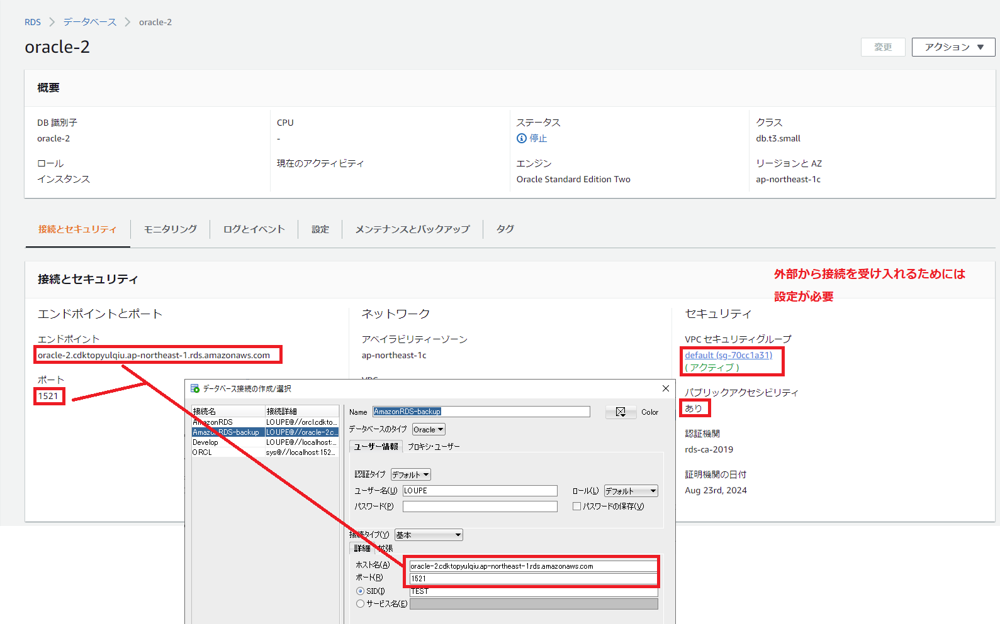
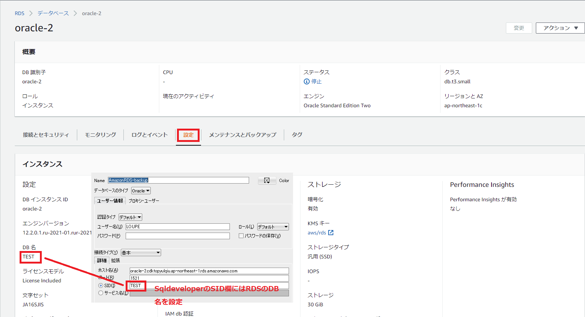
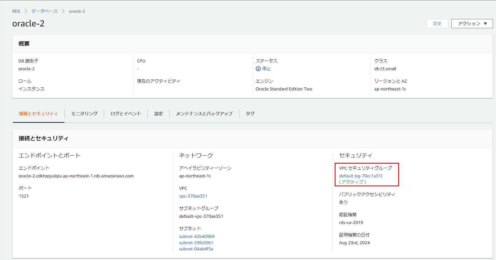
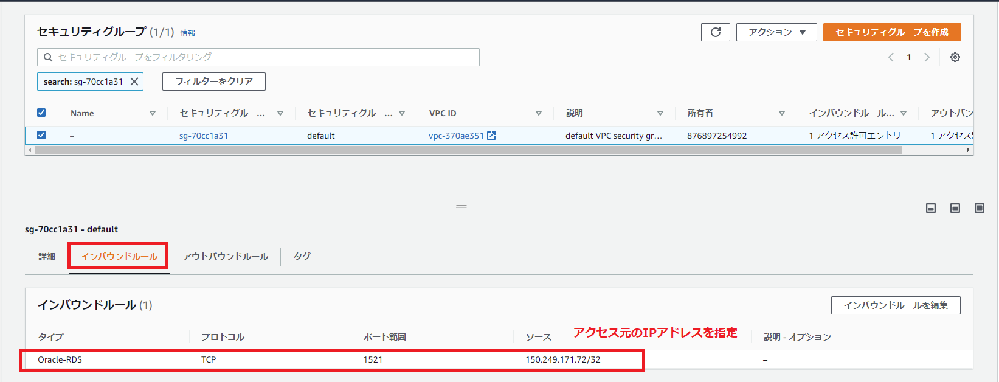

#### Amazon RDSとの接続

以下の要素がAWS Consoleから確認もしくは設定する必要がある

    必要な情報
    ・エンドポイントとポート
    ・DB名(注意：DB識別子ではない)

    セキュリティ関連
    ・セキュリティグループから接続元のIPアドレスのみ許可
参考リンク： https://ap-northeast-1.console.aws.amazon.com/rds/home?region=ap-northeast-1#database:id=oracle-2;is-cluster=false;tab=configuration

