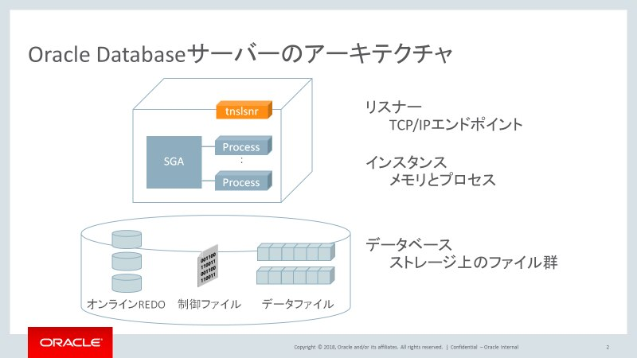
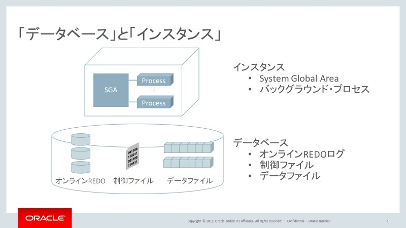
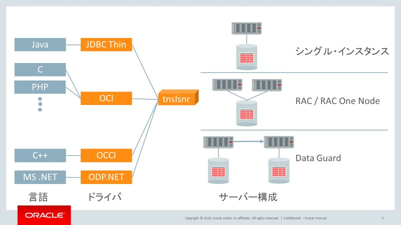
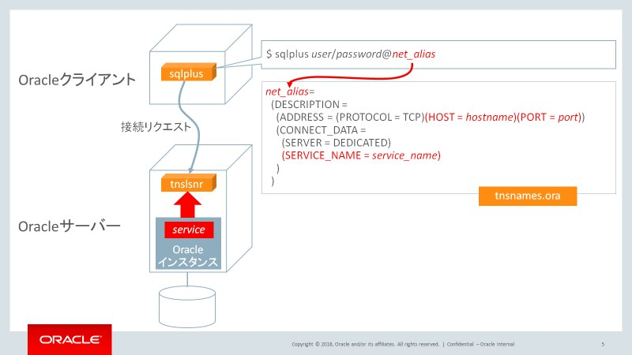
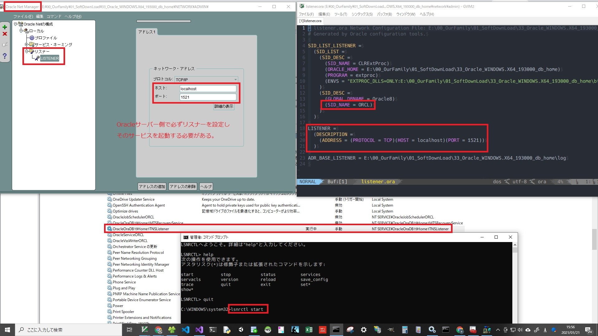
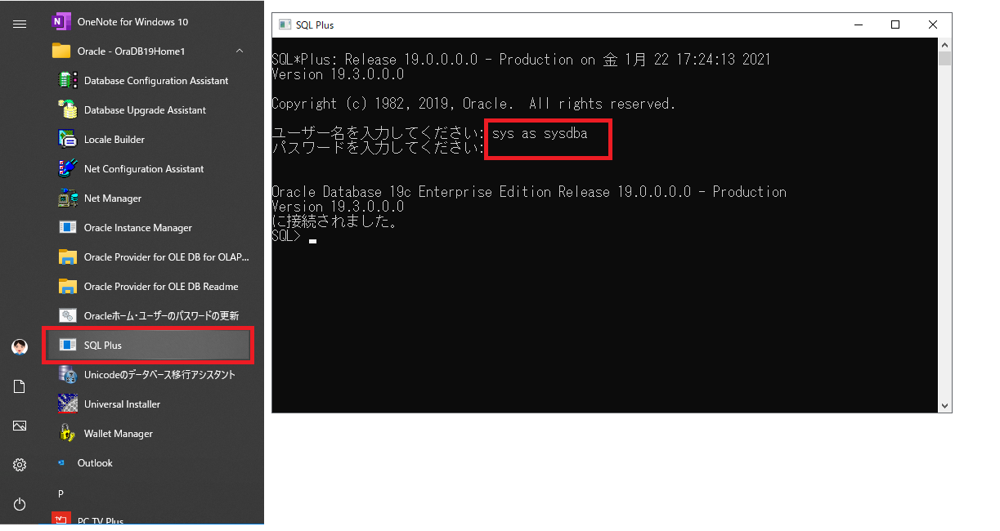
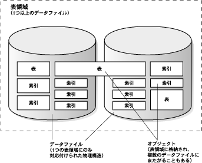
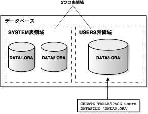
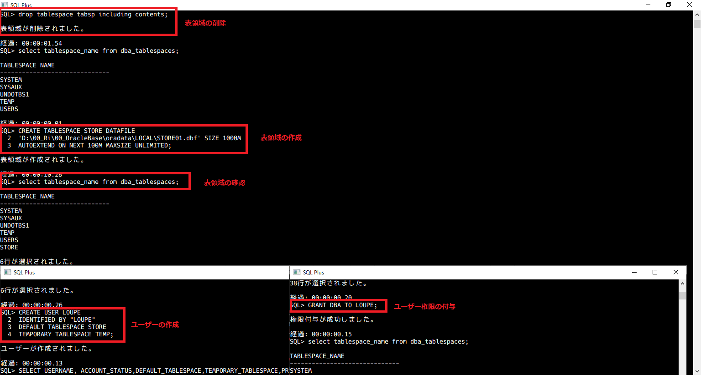
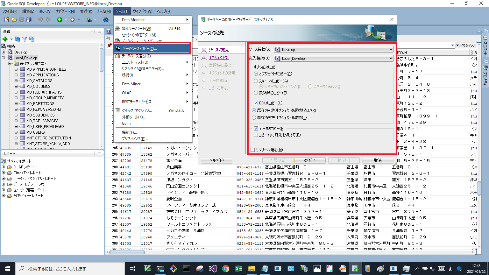

#### Oracleデータベース概要

Oracleデータベースとは？

    以下の３種類の集合体である。
    ・データベース（ストレージ上のファイルのこと）
    ・インスタンス（メモリとプロセスのこと）
    ・リスナー（DB接続用コンポーネント）
参考リンク： https://blogs.oracle.com/otnjp/kusakabe-003



データベースとは？

    ストレージ上に構成されたオンラインREDOログ、制御ファイル、データファイルの集合を指す

インスタンスとは？

    共有メモリ領域(System Global Area)とバックグラウンド・プロセス群を指す

    確認方法： Oracle Instance Managerから
    用途：DB接続先を決めるとき(サービス名かSIDが必要なる)



WindowsServerでの確認
インスタンスはWindowsサーバーの「サービス」から確認できる。


#### リスナーについて

Oracle Databaseでのネットワーク接続にかかわる部分を指す。
また、リスナーはOracleサーバーの構成とは独立して存在する。


- リスナーと言語、DBとの関係


- リスナーの接続文字列


- リスナーの設定と各コンポーネント間の関係

一番簡単な方法はtnsnames.oraに以下の情報を記録すること
一番上の階層に「接続記述子」記入
（外からこれを呼び出すことによって詳細の接続先やSIDなどが分かる）
(例)
接続先：localhost
ポート番号：1512
SID: インスタンス名 もしくは
[ SERVICE_NAME : サービス名 ]
この場所の確認方法
Oracle Net Managerを起動して、Windowのタイトルバーに
パスが表示される。

接続方法を修正する場合は
Oracle Netの構成
  ローカル
    サービス・ネーミング
      vcdb(asp.netのweb.configファイルのdatasource=vcdbと一致する)


#### sqlplusの始め方

    sqlplusを起動して
    ID：sys as sysdba
    password: (設定したパスワードを入力)



```
    --sqlplusを見やすくする

    SET PAGESIZE 1000
    SET LINESIZE 32767
    SET LONG 30000
    SET COLSEP '#'
    SET HEADING ON
    SET HEADSEP '|'
    SET TAB OFF
    SET TIMING ON
    SET TRIMOUT ON
    SET TRIMSPOOL ON
    SET WRAP ON
    SET NUM 10
    ALTER SESSION SET NLS_DATE_FORMAT = 'YYYY/MM/DD HH24:MI:SS';
```

#### 表領域の作成

表、ビュー、その他のデータベース・オブジェクトなど)をグループ化したもの
つまりSqlServerのDBとして理解すればよい。
実態はデータファイルなど
用途：DB作成時
参考URL: https://docs.oracle.com/cd/E15817_01/server.111/e05765/physical.htm

表領域とテーブルは同じ概念でない。表領域はテーブルが属する論理的場所である。

- 作成クエリ：

```
    -- 表領域STOREを'D:\oradata\orcl\STORE1.dbf'に作成する
    -- サイズは300M。300Mを超えたら100Mずつ自動拡張する
    CREATE TABLESPACE LOUPE_DATA DATAFILE
     'D:\oradata\orcl\LOUPE_DATA01.dbf' SIZE 1000M
     AUTOEXTEND ON NEXT 100M MAXSIZE UNLIMITED;
```

-  表領域を削除する

```
    DROP TABLESPACE {表領域} INCLUDING CONTENTS;
```

- 表領域確認クエリ

```
    SELECT TABLESPACE_NAME FROM DBA_TABLESPACES;
```

- 表領域の概念



- 表領域の作成及びユーザー作成クエリ



---
#### ユーザー関連

- ユーザー作成用クエリ

```
    -- ユーザー名、パスワード、使用する表領域を 設定する

    CREATE USER LOUPE
    IDENTIFIED BY "LOUPE"
    DEFAULT TABLESPACE store
    TEMPORARY TABLESPACE temp

```
- 確認用

```
    -- Oracleのすべてのユーザーを確認する（項目指定） 
    SELECT USERNAME,ACCOUNT_STATUS,DEFAULT_TABLESPACE,TEMPORARY_TABLESPACE,PROFILE
    FROM DBA_USERS
    ORDER BY USERNAME;

```
- ユーザーの権限を確認する

```
    SELECT * FROM DBA_SYS_PRIVS WHERE GRANTEE = 'LOUPE';

    {権限}（カンマ区切りで複数指定可）
    CREATE SESSION・・・・・・セッション接続権限
    CREATE VIEW ・・・・・・・View作成権限
    UNLIMITED TABLESPACE・・・すべての表領域に対し、無制限の領域割り当て制限をユーザーに付与する
    SELECT ANY TABLE・・・・・SELECT実行権限
    INSERT ANY TABLE・・・・・INSERT実行権限
    DELETE ANY TABLE・・・・・DELETE実行権限
    UPDATE ANY TABLE・・・・・UPDATE実行権限
```
- ユーザーの権限を削除する

```
    REVOKE CREATE SESSION FROM LOUPE;
```
- ユーザーに権限を付与する(いちいち与えるのは面倒なので、DBA権限を付与する)

```
    GRANT DBA TO LOUPE;

    (補足)DBAロール　について
    Oracle的には二番目につよい権限で
    一番目につよい権限はSYSDBA
    SYSDBAとDBAの違いは「DBのガワ操作」ができるかどうか等
    DBの枠（ガワ）は操作ができないが、内部（テーブルとか）の操作に不自由することはない
```
- ユーザーのデフォルト表領域を変更

```
    ALTER USER LOUPE DEFAULT TABLESPACE LOUPE_DATA;
```
---


#### SqlDeveloperから接続

以下のように設定する


#### DB移行

SqlDeveloperを使ってDBをまるごと移行することができる。



